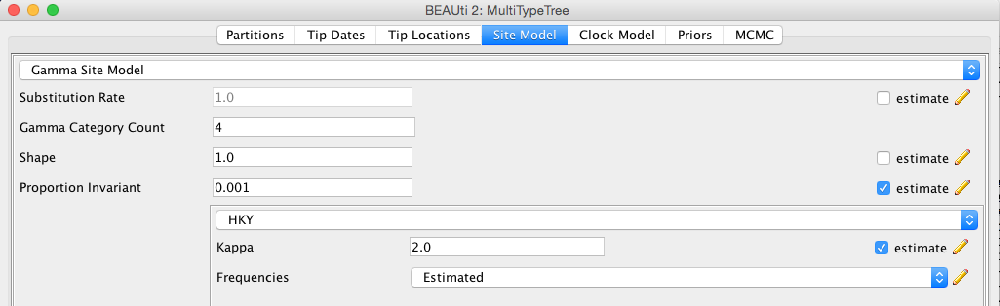
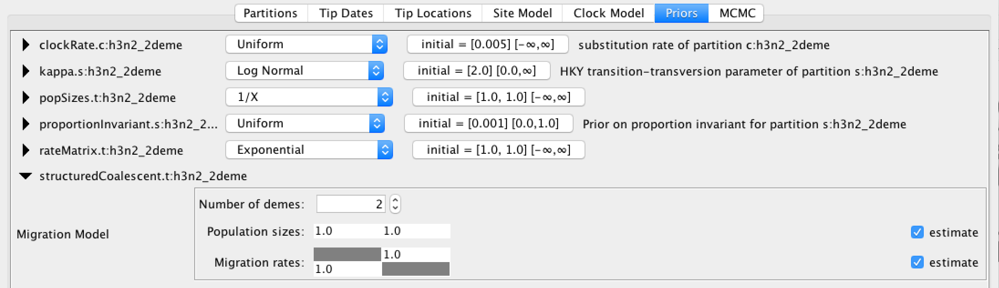
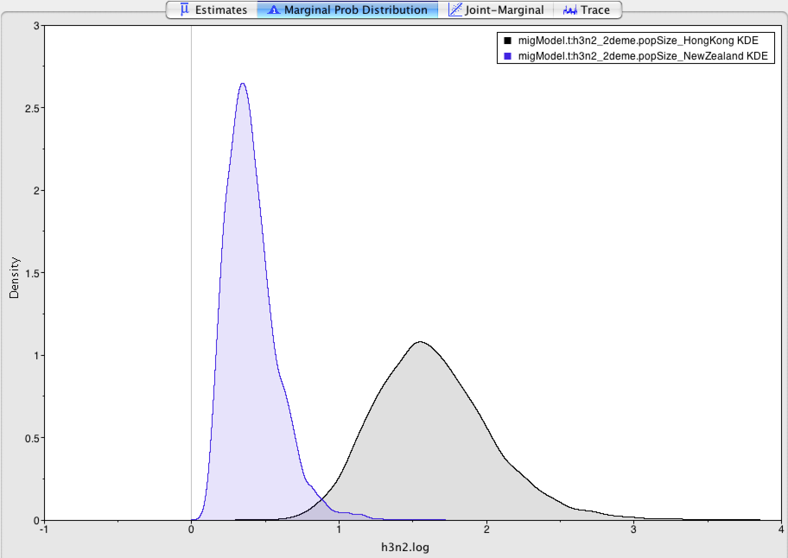
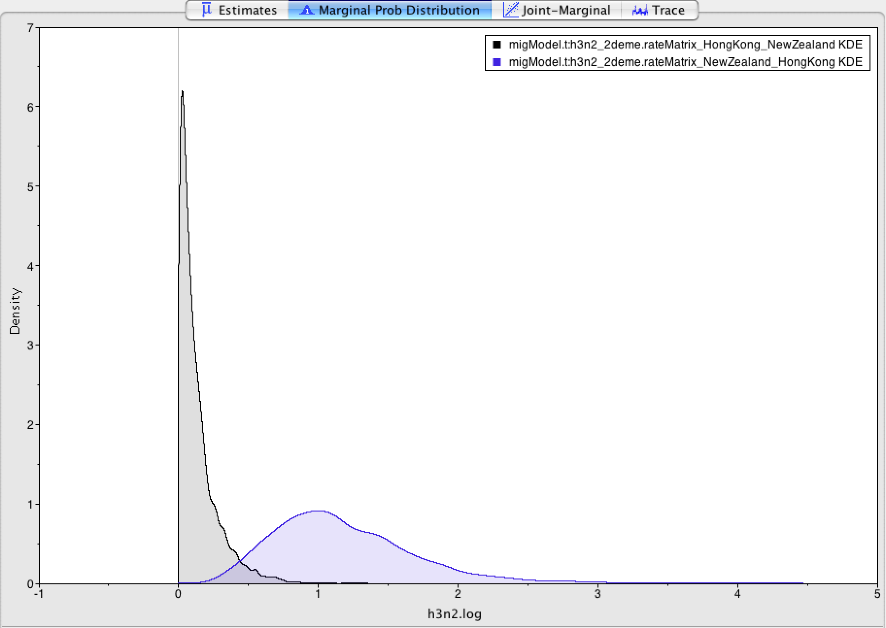

# Background

Population dynamics can influence the shape of a tree. Another thing that has strong influence on the shape of the tree is structure in a population. This is the case as soon as sequences do not mix well, i.e. they cluster together. One cause of this clustering is due to geography. Samples may not have been taken from the same geographic region, leading to clustering of samples from the same region. This clustering of samples can bias the estimation of parameters. The extension of the classic coalescent to the structured coalescent by allowing for migration between regions is trying to circumvent this by allowing individual regions to have distinct coalescent rates and by allowing migration between those regions.

# Programs used in this Exercise

### BEAST - Bayesian Evolutionary Analysis Sampling Trees

BEAST version 2.4.2 .

### BEAUti - Bayesian Evolutionary Analysis Utility

GUI to create `*.xml` for BEAST2.

### Tracer 

Tracer ([http://tree.bio.ed.ac.uk/software/tracer](http://tree.bio.ed.ac.uk/software/tracer)) is used to summarize the posterior estimates of the various parameters sampled by the Markov Chain. It includes code to analyze estimates of past population dynamics from `*.log` files and `*.trees` files. It is mainly used for visual inspection and assessment of convergence of MCMC runs. It helps to quickly view median estimate and 95% credible intervals (which approximate the 95% highest posterior density intervals) of the parameters, and calculates the effective sample sizes (ESS) of parameters. It also helps to visualize potential parameter correlations.

### TreeAnnotator 

TreeAnnotator is a program that comes with BEAST2. It allows to summarize the analysis of sampled trees.

# Practical: MultiTypeTree

In this tutorial we will estimate migration rates, effective population sizes and locations of internal nodes using the structured coalescent implemented in BEAST2, MultiTypeTree .

The aim is to:

-  Learn how to infer structure from trees with sampling location
-  Get to know how to choose the set-up of such an analysis
-  Get to know the advantages and disadvantages of working with structured trees

## The Data
The dataset consists of 60 Influenza A/H3N2 sequences sampled in Hong Kong and in New Zealand between 2001 and 2005. South-East Asia has been hypothesized to be a global source location of seasonal Influenza, while more temperate regions such as New Zealand are assumed to be global sinks , meaning that Influenza strains are more likely to migrate from the tropic to the temperate regions then vice versa. We want to see if we can infer this source-sink dynamic from sequence data using the structured coalescent. 

## Creating the Analysis File with BEAUti

We will use BEAUti to generate the input XML for BEAST2 from the sequence alignment.

### Install BEAST 2 Plug-Ins

The packages MultiTypeTree is not implemented in the core of BEAST, but has to be installed (Figure [1](#fig:install_mtt)). 

<figure>
	
	
	<figcaption>Figure 1: Install MultiTypeTree.</figcaption>
</figure>
 

To be able to make `.xml`'s for MultiTypeTree, we have to load the MultiTypeTree template `File > Template > MultiTypeTree`. This template allows to specify additional things, such as sampling location, which one can not specify using the standard interface, as well as parameters such as the migration rates.
After setting the template, we can load the alignment of the H3N2 data `File > Add Alignment`.
Since the sequences were sampled through time, we have to specify the sampling dates. These are included in the sequence names. To set the sampling dates, go to **Tip Dates**, guess them by splitting after the _ and then choose the last group. There are two different ways in how BEAST can interpret sampling dates. They are labeled as **Since some time in the past** and **Before the present**. The easiest way to check if you have used the correct one is by checking `Height`. If the setup is correct, the sequences sampled the most recently (i.e. 2005.66) should have a Height of 0 while all other tips should be larger then 0 (Figure [2](#fig:sampling_dates)).

<figure>
	
	
	<figcaption>Figure 2: Sampling dates.</figcaption>
</figure>
 

The main contrast in the setup to previous analyses is that we include additional information about the sampling location of sequences. Sequences were taken from patients in Hong Kong and New Zealand. We can specify these sampling locations by going to **Tip Locations** in BEAUti and guessing the locations. Use here the second group after splitting the names on the character _. After guessing the tip locations, the column **Location** should contain the entries Hong Kong and New Zealand (Figure [3](#fig:sampling_locations)).

<figure>
	
	
	<figcaption>Figure 3: Sampling locations.</figcaption>
</figure>
 

For this analysis, we will be using the HKY model. The HKY model infers different rates for transversion and transition. Transition being the change within purines (**A** and **G**) and pyrimidines (**T** and **C**) and transversion being the change among those groups. 

We also want to allow for heterogeneity between sites, which we can do by setting the **Gamma Category Count** to a value greater than 0 (normally between 4 and 6) and ticking the **estimate** box for the shape parameter (Figure [4](#fig:hky)). 

<figure>
	
	
	<figcaption>Figure 4: Setup of the site model.</figcaption>
</figure>
 

To speed up convergence, we leave the branch model on the Strict Clock model and  set a different value for the clock rate (default is 1). A value of 0.005 substitutions * site^(-1) * year^(-1)  is closer to the truth.

Since we have more than one deme (Hong Kong and New Zealand), we can estimate the effective population size of those two demes separately. Additionally, these demes are connected, so we can (or need to) allow for migration between them.
By default, the migration rates and population sizes are not estimated. To change this, we have to go to the Priors setting. There, we have to check the two **estimate** boxes for the population sizes and the migration rates. 

 

After checking those two boxes, there will be two new fields appearing, where we can set the priors for the population sizes and the migration rates. 
Since we know the time scale of our data (few years), we can choose a proper prior for the migration rates, like an exponential prior distribution with mean 1.  
Figure [5](#fig:est_migrates) shows the final setup for the priors.

<figure>
	
	
	<figcaption>Figure 5: Check the boxes that say estimate for the population size and the migration rates and change it to an exponential prior with mean 1.</figcaption>
</figure>
 

The rest of the settings we can leave as they are.

After saving, we get an `*.xml`, which we can use in BEAST2. The run will take a bit of time. If the MultiTypeTree run consumes too much CPU power, you can just close it and then use the pre-cooked `*.log` and `*.trees` files later instead.

### Analysis of the MultiTypeTree run

Load the `*.log` files into tracer. First, we should check that the run has converged by looking at the ESS values. If all ESS values are above 200, we should be on the safe side.

Next, we can have a look at the estimates of the effective population sizes (Figure [6](#fig:estimated_peff)). 

<figure>
	
	
	<figcaption>Figure 6: Estimated effective population sizes.</figcaption>
</figure>
 

Hong Kong (7 Mio Inhabitants) is inferred to have the larger effective population size than New Zealand ( 4.5 Mio Inhabitants). Keep in mind though that the effective population size is not only dependent on the population size itself, but also on e.g. transmission rates or contact rates. Differences in the real population size are therefore not necessarily reflected in the effective population size. However, they can still act as a sanity test. Next, we want to have a look at the inferred migration rates (Figure [7](#fig:etimated_mig)).

<figure>
	
	
	<figcaption>Figure 7: Estimated migration rates.</figcaption>
</figure>
 

----

As we stated at the beginning, it is assumed that South-East Asia works as a global source of influenza, while e.g. Oceania acts as a sink.

> Do the inferred migration rates agree with this hypothesis?

After having looked at the inferred parameters, we can look at the inferred trees.
We can either look at all the sampled trees individually or can use a summary of all tree. This can be done by using the program TreeAnnotator:

> We need to specify at least 4 settings there. First, the burn-in percentage, then the input tree file, the output tree file for which we have to specify a file name and the `Node Heights` (set it to `Mean Heights`)

MultiTypeTree logs 3 different tree files:

-  The first one is the `*.map.trees` file. It contains the maximum posterior tree for the analysis up to a sample of the MCMC. This tree is the tree with the highest posterior probability that has been visited so far.
- The second one is the `*.trees` file. It contains the logged trees with so called single child node. In a normal tree, all nodes have two (or sometimes more) children. The nodes there are coalescent events. The single child nodes on the other hand are migration events (in this case a migration event between Hong Kong and New Zealand). MultiTypeTree infers the timing of those migration events on a branch and logs them in the `*.trees` file.
- The third tree file logged is the `*.typedNode.trees`. This file does not use single child nodes. Instead, every coalescent event (here always a node with two daughter lineages) has a location (or state or color or type) where it was inferred to take place (see Figure [8](#fig:single_child))

<figure>
	
	
	<figcaption>Figure 8: An example of a tree where the migration events are logged as single child nodes (left) and of the same tree where only the location of a coalescent event is logged (right).</figcaption>
</figure>
 

To summarize all the trees, we will need the `*.typedNode.trees` files, since TreeAnnotator cannot handle single child nodes. We will also need to specify the **Burnin percentage**, which we can guess from looking at the traces of the parameter estimates in Tracer (10% should be more than enough). Next, we also need to specify where the output will be saved and under what name. After that, we can run the analysis.

When TreeAnnotator is finished, we can visualize the summarized MultiTypeTree run with FigTree. 

> Open the program and go to `File > Open`, and open the output tree file from TreeAnnotator. 
>
> To color the tree, go to **Appearance** and change **Colour by** and **Width by**. 
>
> To get the coloring by inferred location, one has to set it to **type**. The expressions **type, state, location and color** are often used interchangeably.
> The color gives the estimated (most likely) location of a node (red for Hong Kong and blue for New Zealand), the width gives the certainty of a color. The more certain the estimate is, the wider the branch above (towards the root of) the node. You can also change the **Line Weight** to better see difference in the width of branches. 

<figure>
	
	
	<figcaption>Figure 9: Color tree according to the inferred location.</figcaption>
</figure>
 

Next, we would like to know how certain we are about the node heights. 

> This can be visualized by going to **Node Bars** and there **Display** the 95% HPD of node heights, which gives the 95% credibility interval of node heights (the mean is indicated by the shown node height).

<figure>
	
	
	<figcaption>Figure 10: Set the 95% HPD for the node heights.</figcaption>
</figure>
 

### Some considerations for using the structured Coalescent (or any structured method)

-  Inferring structure on a tree is hard and requires a lot of assumptions, e.g. that the migration rates don't change over time or populations are constant. 
-  The number of migration events on a tree might be very low, to infer a rate from such a low number of events can be very hard. In general, it is easier to infer rates within a region (here the effective population size) than it is to infer rates between them, as there are simply more events within than between regions.
-  Despite considering structure in a tree, there might still be states or locations etc. that were not sampled. Even if a node is inferred to be in a location with high certainty, the results could look completely different if samples from other locations would be considered as well.

# Useful Links

-  [*Bayesian Evolutionary Analysis with BEAST 2*](http://www.beast2.org/book.html)  
-  BEAST 2 website and documentation: [http://www.beast2.org/](http://www.beast2.org/) 
-  BEAST 1 website and documentation: [http://beast.bio.ed.ac.uk](http://beast.bio.ed.ac.uk) 
-  Join the BEAST user discussion: [http://groups.google.com/group/beast-users](http://groups.google.com/group/beast-users) 

----

The content of this tutorial is based on the [MultiTypeTree](https://github.com/CompEvol/MultiTypeTree/wiki/Beginner's-Tutorial) tutorial by Tim Vaughan.

----

# Relevant References


